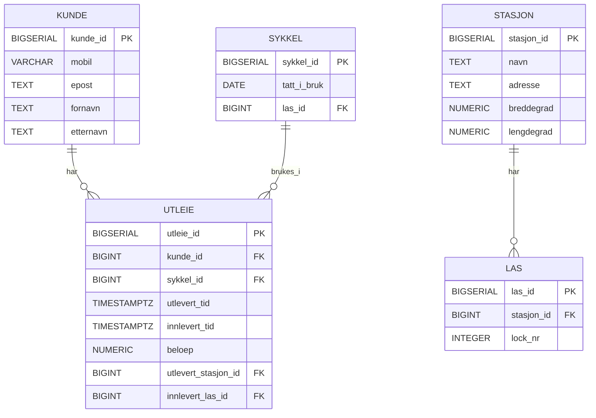
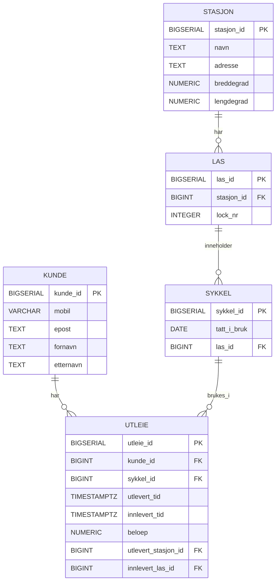
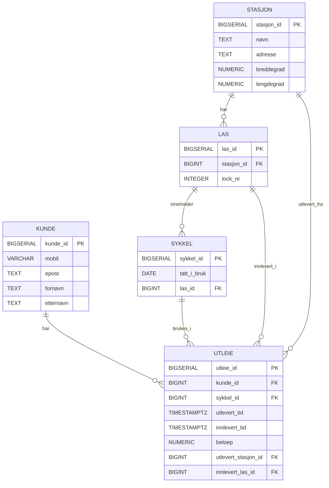

# Besvarelse - Refleksjon og Analyse

**Student:** Mehroz Shahzad

**Studentnummer:** mesha4201

**Dato:** 27.02.26

---

## Del 1: Datamodellering

### Oppgave 1.1: Entiteter og attributter

**Identifiserte entiteter:**

- Kunde
- Stasjon
- Lås
- Sykkel
- Utleie

**Attributter for hver entitet:**

Kunde:
- kunde_id (primærnøkkel)
- mobil
- epost
- fornavn
- etternavn

Stasjon:
- stasjon_id (primærnøkkel)
- navn
- adresse
- breddegrad
- lengdegrad

Lås:
- las_id (primærnøkkel)
- stasjon_id (fremmednøkkel)
- lock_nr

Sykkel:
- sykkel_id (primærnøkkel)
- tatt_i_bruk
- las_id (fremmednøkkel, NULL når sykkelen er utleid)

Utleie:
- utleie_id (primærnøkkel)
- kunde_id (fremmednøkkel)
- sykkel_id (fremmednøkkel)
- utlevert_tid
- innlevert_tid (NULL dersom aktiv utleie)
- beloep
- utlevert_stasjon_id (fremmednøkkel)
- innlevert_las_id (fremmednøkkel)

---

### Oppgave 1.2: Datatyper og `CHECK`-constraints

**Valgte datatyper og begrunnelser:**

For primaernøkler har jeg brukt BIGSERIAL for å lage automatiske, unike ID-er.  
Teksttyper som navn og adresse kalles TEXT.  
For å gi landskode til mobilnummeret, brukes VARCHAR(15).  
For å håndtere tidssoner riktig, er tidspunkter lagret som TIMESTAMPTZ.  
For å forhindre avrundingsfeil er beløpet lagret som NUMERIC(10,2).

**`CHECK`-constraints:**

- Mobilnummeret må inneholde mellom 8 og 15 siffer.
- E-poster må skrives i et enkelt format.
- Summen må enten være større enn eller lik 0.
- Innleveringsfristen kan ikke være før utleveringsfristen.
- Lock_nr må overstige 0.

**ER-diagram:**



---

### Oppgave 1.3: Primærnøkler

**Valgte primærnøkler og begrunnelser:**

Jeg har bestemt meg for å bruke BIGSERIAL som primaernøkler for alle entiteter. Dette gir sikre identifikatorer som ikke vil endres hvis naturlige egenskaper som mobilnummer eller e-post endres.

**Naturlige vs. surrogatnøkler:**

For eksempel kunne naturlige nøkler vært brukt til å registrere mobilnumre i kundetabellen, men surrogatnøkler er mer pålitelige fordi disse verdiene kan endres over tid.

**Oppdatert ER-diagram:**



---

### Oppgave 1.4: Forhold og fremmednøkler

**Identifiserte forhold og kardinalitet:**

- En stasjon har en betydelig mengde låser (1:N)
- En forbruker kan ha flere utleier (1:N)
- Mange utleier kan bruke en sykkel (1:N)
- Kun én sykkel kan holdes i en lås

**Fremmednøkler:**

- las.stasjon_id = stasjon.stasjon_id
- sykkel.las_id = las.las_id
- utleie.kunde_id = kunde.kunde_id
- utleie.sykkel_id = sykkel.sykkel_id
- utleie.utlevert_stasjon_id = stasjon.stasjon_id
- utleie.innlevert_las_id = las.las_id

**Oppdatert ER-diagram:**



---

### Oppgave 1.5: Normalisering

**Vurdering av 1. normalform (1NF):**

På grunn av det faktum at alle tabeller inneholder atomiske (udelte) verdier, tilfredsstiller datamodellen 1NF. Tabellene mangler gjentatte grupper og flerverdige attributter. En primaernøkkel brukes til å identifisere hver rad enkelt, og hvert attributt har bare én verdi per celle.

**Vurdering av 2. normalform (2NF):**

Fordi hver tabell har en enkel primærnøkkel (ikke en sammensatt nøkkel), tilfredsstiller datamodellen 2NF. Som et resultat kan det ikke eksistere noen delvise avhengigheter. Alle ikke-nøkkelegenskaper er fullstendig funksjonelt avhengige av hele primærnøkkelen som finnes i hver tabell.

**Vurdering av 3. normalform (3NF):**

Fordi det ikke finnes transitive avhengigheter, tilfredsstiller datamodellen 3NF. For eksempel er kundedata kun lagret i kundetabellen i stedet for i utleietabellen. Tilsvarende er Stasjon-tabellen den eneste kilden til informasjon om hver stasjon. I stedet for å lagre duplisert data refererer utleie til disse entitetene via fremmednøkler. Som et resultat er primærnøkkelen direkte avhengig av alle ikke-nøkkelegenskaper.

**Eventuelle justeringer:**

Det var ikke nødvendig å gjøre justeringer for å oppnå 3NF, da datamodellen allerede oppfyller kravene til 1NF, 2NF og 3NF.

---

## Del 2: Database-implementering

### Oppgave 2.1: SQL-skript for database-initialisering

**Plassering av SQL-skript:**

[Bekreft at du har lagt SQL-skriptet i `init-scripts/01-init-database.sql`]

**Antall testdata:**

- Kunder: 5
- Sykler: 100
- Sykkelstasjoner: 5
- Låser: 100 (20 per stasjon)
- Utleier: 50 (45 avsluttede + 5 aktive)

---

### Oppgave 2.2: Kjøre initialiseringsskriptet

**Dokumentasjon av vellykket kjøring:**

[Skriv ditt svar her - f.eks. skjermbilder eller output fra terminalen som viser at databasen ble opprettet uten feil]

**Spørring mot systemkatalogen:**

```sql
SELECT table_name 
FROM information_schema.tables 
WHERE table_schema = 'public' 
  AND table_type = 'BASE TABLE'
ORDER BY table_name;
```

**Resultat:**

```
[Skriv resultatet av spørringen her - list opp alle tabellene som ble opprettet]
```

---

## Del 3: Tilgangskontroll

### Oppgave 3.1: Roller og brukere

**SQL for å opprette rolle:**

```sql
[Skriv din SQL-kode for å opprette rollen 'kunde' her]
```

**SQL for å opprette bruker:**

```sql
[Skriv din SQL-kode for å opprette brukeren 'kunde_1' her]
```

**SQL for å tildele rettigheter:**

```sql
[Skriv din SQL-kode for å tildele rettigheter til rollen her]
```

---

### Oppgave 3.2: Begrenset visning for kunder

**SQL for VIEW:**

```sql
[Skriv din SQL-kode for VIEW her]
```

**Ulempe med VIEW vs. POLICIES:**

[Skriv ditt svar her - diskuter minst én ulempe med å bruke VIEW for autorisasjon sammenlignet med POLICIES]

---

## Del 4: Analyse og Refleksjon

### Oppgave 4.1: Lagringskapasitet

**Gitte tall for utleierate:**

- Høysesong (mai-september): 20000 utleier/måned
- Mellomsesong (mars, april, oktober, november): 5000 utleier/måned
- Lavsesong (desember-februar): 500 utleier/måned

**Totalt antall utleier per år:**

[Skriv din utregning her]

**Estimat for lagringskapasitet:**

[Skriv din utregning her - vis hvordan du har beregnet lagringskapasiteten for hver tabell]

**Totalt for første år:**

[Skriv ditt estimat her]

---

### Oppgave 4.2: Flat fil vs. relasjonsdatabase

**Analyse av CSV-filen (`data/utleier.csv`):**

**Problem 1: Redundans**

[Skriv ditt svar her - gi konkrete eksempler fra CSV-filen som viser redundans]

**Problem 2: Inkonsistens**

[Skriv ditt svar her - forklar hvordan redundans kan føre til inkonsistens med eksempler]

**Problem 3: Oppdateringsanomalier**

[Skriv ditt svar her - diskuter slette-, innsettings- og oppdateringsanomalier]

**Fordeler med en indeks:**

[Skriv ditt svar her - forklar hvorfor en indeks ville gjort spørringen mer effektiv]

**Case 1: Indeks passer i RAM**

[Skriv ditt svar her - forklar hvordan indeksen fungerer når den passer i minnet]

**Case 2: Indeks passer ikke i RAM**

[Skriv ditt svar her - forklar hvordan flettesortering kan brukes]

**Datastrukturer i DBMS:**

[Skriv ditt svar her - diskuter B+-tre og hash-indekser]

---

### Oppgave 4.3: Datastrukturer for logging

**Foreslått datastruktur:**

[Skriv ditt svar her - f.eks. heap-fil, LSM-tree, eller annen egnet datastruktur]

**Begrunnelse:**

**Skrive-operasjoner:**

[Skriv ditt svar her - forklar hvorfor datastrukturen er egnet for mange skrive-operasjoner]

**Lese-operasjoner:**

[Skriv ditt svar her - forklar hvordan datastrukturen håndterer sjeldne lese-operasjoner]

---

### Oppgave 4.4: Validering i flerlags-systemer

**Hvor bør validering gjøres:**

[Skriv ditt svar her - argumenter for validering i ett eller flere lag]

**Validering i nettleseren:**

[Skriv ditt svar her - diskuter fordeler og ulemper]

**Validering i applikasjonslaget:**

[Skriv ditt svar her - diskuter fordeler og ulemper]

**Validering i databasen:**

[Skriv ditt svar her - diskuter fordeler og ulemper]

**Konklusjon:**

[Skriv ditt svar her - oppsummer hvor validering bør gjøres og hvorfor]

---

### Oppgave 4.5: Refleksjon over læringsutbytte

**Hva har du lært så langt i emnet:**

[Skriv din refleksjon her - diskuter sentrale konsepter du har lært]

**Hvordan har denne oppgaven bidratt til å oppnå læringsmålene:**

[Skriv din refleksjon her - koble oppgaven til læringsmålene i emnet]

Se oversikt over læringsmålene i en PDF-fil i Canvas https://oslomet.instructure.com/courses/33293/files/folder/Plan%20v%C3%A5ren%202026?preview=4370886

**Hva var mest utfordrende:**

[Skriv din refleksjon her - diskuter hvilke deler av oppgaven som var mest krevende]

**Hva har du lært om databasedesign:**

[Skriv din refleksjon her - reflekter over prosessen med å designe en database fra bunnen av]

---

## Del 5: SQL-spørringer og Automatisk Testing

**Plassering av SQL-spørringer:**

[Bekreft at du har lagt SQL-spørringene i `test-scripts/queries.sql`]


**Eventuelle feil og rettelser:**

[Skriv ditt svar her - hvis noen tester feilet, forklar hva som var feil og hvordan du rettet det]

---

## Del 6: Bonusoppgaver (Valgfri)

### Oppgave 6.1: Trigger for lagerbeholdning

**SQL for trigger:**

```sql
[Skriv din SQL-kode for trigger her, hvis du har løst denne oppgaven]
```

**Forklaring:**

[Skriv ditt svar her - forklar hvordan triggeren fungerer]

**Testing:**

[Skriv ditt svar her - vis hvordan du har testet at triggeren fungerer som forventet]

---

### Oppgave 6.2: Presentasjon

**Lenke til presentasjon:**

[Legg inn lenke til video eller presentasjonsfiler her, hvis du har løst denne oppgaven]

**Hovedpunkter i presentasjonen:**

[Skriv ditt svar her - oppsummer de viktigste punktene du dekket i presentasjonen]

---

**Slutt på besvarelse**
