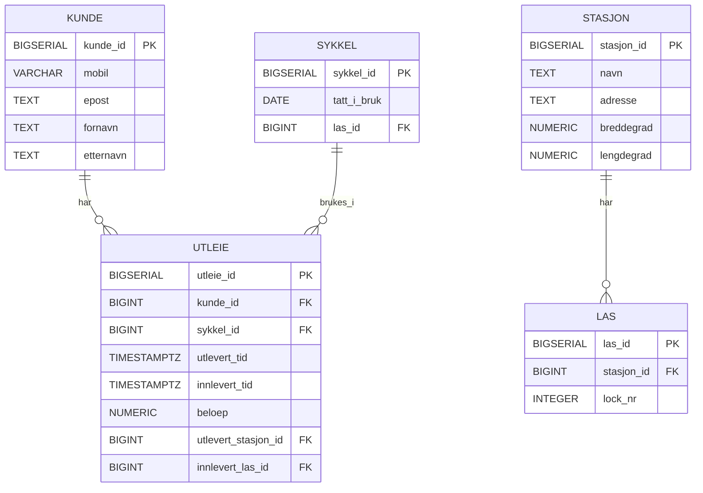
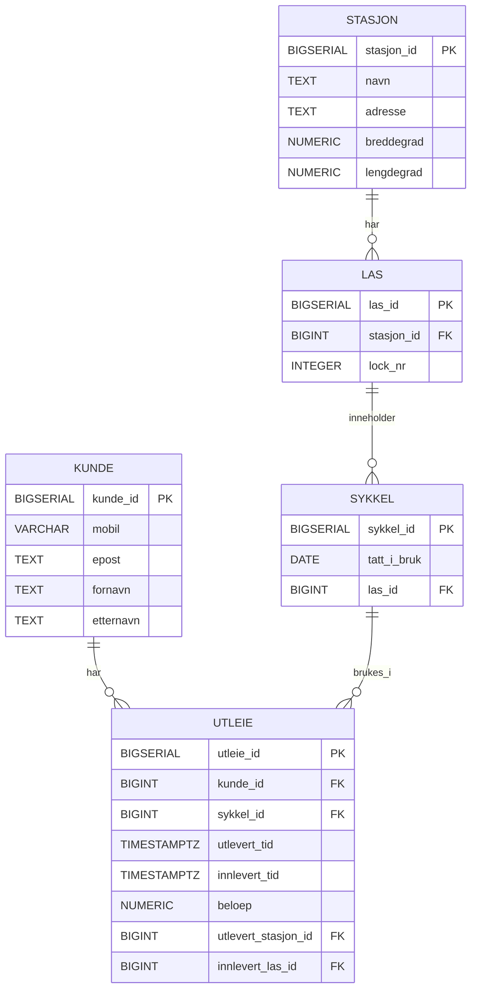
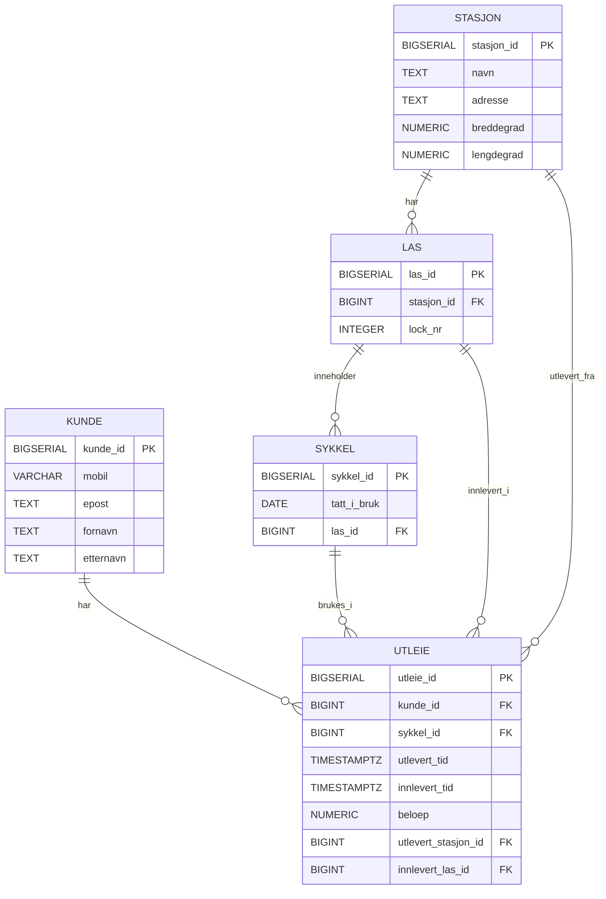

# Besvarelse - Refleksjon og Analyse

**Student:** Mehroz Shahzad

**Studentnummer:** mesha4201

**Dato:** 27.02.26

---

## Del 1: Datamodellering

### Oppgave 1.1: Entiteter og attributter

**Identifiserte entiteter:**

- Kunde
- Stasjon
- Lås
- Sykkel
- Utleie

**Attributter for hver entitet:**

Kunde:
- kunde_id (primærnøkkel)
- mobil
- epost
- fornavn
- etternavn

Stasjon:
- stasjon_id (primærnøkkel)
- navn
- adresse
- breddegrad
- lengdegrad

Lås:
- las_id (primærnøkkel)
- stasjon_id (fremmednøkkel)
- lock_nr

Sykkel:
- sykkel_id (primærnøkkel)
- tatt_i_bruk
- las_id (fremmednøkkel, NULL når sykkelen er utleid)

Utleie:
- utleie_id (primærnøkkel)
- kunde_id (fremmednøkkel)
- sykkel_id (fremmednøkkel)
- utlevert_tid
- innlevert_tid (NULL dersom aktiv utleie)
- beloep
- utlevert_stasjon_id (fremmednøkkel)
- innlevert_las_id (fremmednøkkel)

---

### Oppgave 1.2: Datatyper og `CHECK`-constraints

**Valgte datatyper og begrunnelser:**

For primaernøkler har jeg brukt BIGSERIAL for å lage automatiske, unike ID-er.  
Teksttyper som navn og adresse kalles TEXT.  
For å gi landskode til mobilnummeret, brukes VARCHAR(15).  
For å håndtere tidssoner riktig, er tidspunkter lagret som TIMESTAMPTZ.  
For å forhindre avrundingsfeil er beløpet lagret som NUMERIC(10,2).

**`CHECK`-constraints:**

- Mobilnummeret må inneholde mellom 8 og 15 siffer.
- E-poster må skrives i et enkelt format.
- Summen må enten være større enn eller lik 0.
- Innleveringsfristen kan ikke være før utleveringsfristen.
- Lock_nr må overstige 0.

**ER-diagram:**



---

### Oppgave 1.3: Primærnøkler

**Valgte primærnøkler og begrunnelser:**

Jeg har bestemt meg for å bruke BIGSERIAL som primaernøkler for alle entiteter. Dette gir sikre identifikatorer som ikke vil endres hvis naturlige egenskaper som mobilnummer eller e-post endres.

**Naturlige vs. surrogatnøkler:**

For eksempel kunne naturlige nøkler vært brukt til å registrere mobilnumre i kundetabellen, men surrogatnøkler er mer pålitelige fordi disse verdiene kan endres over tid.

**Oppdatert ER-diagram:**



---

### Oppgave 1.4: Forhold og fremmednøkler

**Identifiserte forhold og kardinalitet:**

- En stasjon har en betydelig mengde låser (1:N)
- En forbruker kan ha flere utleier (1:N)
- Mange utleier kan bruke en sykkel (1:N)
- Kun én sykkel kan holdes i en lås

**Fremmednøkler:**

- las.stasjon_id = stasjon.stasjon_id
- sykkel.las_id = las.las_id
- utleie.kunde_id = kunde.kunde_id
- utleie.sykkel_id = sykkel.sykkel_id
- utleie.utlevert_stasjon_id = stasjon.stasjon_id
- utleie.innlevert_las_id = las.las_id

**Oppdatert ER-diagram:**



---

### Oppgave 1.5: Normalisering

**Vurdering av 1. normalform (1NF):**

På grunn av det faktum at alle tabeller inneholder atomiske (udelte) verdier, tilfredsstiller datamodellen 1NF. Tabellene mangler gjentatte grupper og flerverdige attributter. En primaernøkkel brukes til å identifisere hver rad enkelt, og hvert attributt har bare én verdi per celle.

**Vurdering av 2. normalform (2NF):**

Fordi hver tabell har en enkel primærnøkkel (ikke en sammensatt nøkkel), tilfredsstiller datamodellen 2NF. Som et resultat kan det ikke eksistere noen delvise avhengigheter. Alle ikke-nøkkelegenskaper er fullstendig funksjonelt avhengige av hele primærnøkkelen som finnes i hver tabell.

**Vurdering av 3. normalform (3NF):**

Fordi det ikke finnes transitive avhengigheter, tilfredsstiller datamodellen 3NF. For eksempel er kundedata kun lagret i kundetabellen i stedet for i utleietabellen. Tilsvarende er Stasjon-tabellen den eneste kilden til informasjon om hver stasjon. I stedet for å lagre duplisert data refererer utleie til disse entitetene via fremmednøkler. Som et resultat er primærnøkkelen direkte avhengig av alle ikke-nøkkelegenskaper.

**Eventuelle justeringer:**

Det var ikke nødvendig å gjøre justeringer for å oppnå 3NF, da datamodellen allerede oppfyller kravene til 1NF, 2NF og 3NF.

---

## Del 2: Database-implementering

### Oppgave 2.1: SQL-skript for database-initialisering

**Plassering av SQL-skript:**

SQL-skriptet er lagt i mappen init-scripts/01-init-database.sql i prosjektets rotmappe, i henhold til oppgaveteksten.

**Antall testdata:**

- Kunder: 5
- Sykler: 100
- Sykkelstasjoner: 5
- Låser: 100 (20 per stasjon)
- Utleier: 50 (45 avsluttede + 5 aktive)

---

### Oppgave 2.2: Kjøre initialiseringsskriptet

**Dokumentasjon av vellykket kjøring:**

Jeg startet PostgreSQL-containeren ved hjelp av kommandoen:
docker compose up -d

Deretter kjørte jeg initialiseringsskriptet mot databasen oblig01 med følgende kommando:
docker compose exec -T postgres psql -U admin -d oblig01 < init-scripts/01-init-database.sql

Skriptet ble kjørt uten feil. Terminalen viste at tabeller ble opprettet (CREATE TABLE), testdata ble satt inn (INSERT), og transaksjonen ble avsluttet med COMMIT. Til slutt ble meldingen "Database initialisert!" vist, som bekreftelse på at databasen ble opprettet korrekt.

**Spørring mot systemkatalogen:**

```sql
SELECT table_name 
FROM information_schema.tables 
WHERE table_schema = 'public' 
  AND table_type = 'BASE TABLE'
ORDER BY table_name;
```

**Resultat:**

```
kunde
kunde_login_map
las
stasjon
sykkel
utleie
```

---

## Del 3: Tilgangskontroll

### Oppgave 3.1: Roller og brukere

**SQL for å opprette rolle:**

```sql
DO $$
BEGIN
  IF NOT EXISTS (SELECT 1 FROM pg_roles WHERE rolname = 'kunde') THEN
    CREATE ROLE kunde NOINHERIT;
  END IF;
END$$;
```

**SQL for å opprette bruker:**

```sql
DO $$
BEGIN
  IF NOT EXISTS (SELECT 1 FROM pg_roles WHERE rolname = 'kunde_1') THEN
    CREATE USER kunde_1 WITH PASSWORD 'kunde_1_pass';
    GRANT kunde TO kunde_1;
  END IF;
END$$;
```

**SQL for å tildele rettigheter:**

```sql
GRANT CONNECT ON DATABASE oblig01 TO kunde;
GRANT USAGE ON SCHEMA public TO kunde;

-- Kunden skal kunne lese “offentlig” info om systemet
GRANT SELECT ON stasjon, las, sykkel TO kunde;

-- Kunden skal IKKE kunne lese alle utleier direkte
REVOKE ALL ON utleie FROM kunde;
```

Rollen kunde ble opprettet for å samle rettigheter som kan tildeles flere brukere. Brukeren kunde_1 ble opprettet og tildelt rollen kunde. Rollen har lesetilgang (SELECT) til tabellene stasjon, las og sykkel, men ikke direkte tilgang til utleie. Dette sikrer at kunder ikke kan se alle utleier i systemet.

---

### Oppgave 3.2: Begrenset visning for kunder

**SQL for VIEW:**

```sql
CREATE TABLE IF NOT EXISTS kunde_login_map (
  db_user  TEXT PRIMARY KEY,
  kunde_id BIGINT NOT NULL REFERENCES kunde(kunde_id)
);

INSERT INTO kunde_login_map (db_user, kunde_id)
VALUES ('kunde_1', 1)
ON CONFLICT (db_user) DO UPDATE SET kunde_id = EXCLUDED.kunde_id;

CREATE OR REPLACE VIEW v_mine_utleier AS
SELECT u.*
FROM utleie u
JOIN kunde_login_map m ON m.kunde_id = u.kunde_id
WHERE m.db_user = current_user;

GRANT SELECT ON v_mine_utleier TO kunde;
```

**Ulempe med VIEW vs. POLICIES:**

En ulempe med å bruke VIEW for autorisasjon er at sikkerheten ligger i applikasjonslogikken og ikke direkte på radnivå i databasen. Dersom noen får direkte tilgang til tabellen utleie, vil VIEW-en ikke beskytte dataene. Med Row-Level Security (RLS) policies håndheves tilgangsreglene direkte av databasen på radnivå, noe som gir sterkere og mer robust sikkerhet.

---

## Del 4: Analyse og Refleksjon

### Oppgave 4.1: Lagringskapasitet

**Gitte tall for utleierate:**

- Høysesong (mai-september): 20000 utleier/måned
- Mellomsesong (mars, april, oktober, november): 5000 utleier/måned
- Lavsesong (desember-februar): 500 utleier/måned

**Totalt antall utleier per år:**

Høysesong: 5 × 20000 = 100000
Mellomsesong: 4 × 5000 = 20000
Lavsesong: 3 × 500 = 1500

Totalt: 100000 + 20000 + 1500 = 121500 utleier per år

**Estimat for lagringskapasitet:**

Jeg estimerer lagringsbehovet basert på tabellen utleie, siden det er den som vokser mest gjennom året. De andre tabellene (kunde, stasjon, las, sykkel, kunde_login_map) er relativt små og vil endres lite sammenlignet med antall utleier.

En utleie-rad består hovedsakelig av flere BIGINT-felt (id-er), to TIMESTAMPTZ (tidspunkter) og et beløp (NUMERIC). Med overhead i PostgreSQL (rad-header, alignment og NULL-bitmap) estimerer jeg ca. 120 bytes per utleie.

Dermed blir lagringsbehovet for selve utleie-tabellen:
121500 utleier × 120 bytes ≈ 14 580 000 bytes ≈ 13,9 MiB

**Totalt for første år:**

Utleie-data: ~13,9 MiB
Indekser på utleie: ~8 MiB
Andre tabeller + generell overhead: ~3–8 MiB

Totalt estimat: ca. 25–30 MiB for første driftsår

---

### Oppgave 4.2: Flat fil vs. relasjonsdatabase

**Analyse av CSV-filen (`data/utleier.csv`):**

**Problem 1: Redundans**

Ole Hansen med mobil +4791234567 og e-post ole.hansen@example.com forekommer på flere rader.

Kari Olsen med mobil +4792345678 og e-post kari.olsen@example.com forekommer også flere ganger.

Stasjonen "Sentrum Stasjon, Karl Johans gate 1 Oslo" gjentas på mange rader.

Sykkelmodellen "City Bike Pro" forekommer flere ganger med samme innkjøpsdato.

**Problem 2: Inkonsistens**

Hvis Ole Hansen bytter mobilnummer, må dette oppdateres på alle rader der han forekommer.

Hvis én rad oppdateres, men ikke en annen, kan vi få to ulike mobilnumre for samme person.

Hvis adressen til "Sentrum Stasjon" endres, må alle rader med denne stasjonen oppdateres manuelt.

**Problem 3: Oppdateringsanomalier**

Oppdateringsanomalier:
- Hvis Kari Olsen endrer e-postadresse, må alle rader hvor hun forekommer oppdateres. Hvis én rad glemmes, oppstår inkonsistens.

Innsettingsanomalier:
- Det er vanskelig å registrere en ny kunde uten at kunden samtidig har en utleie. CSV-filen beskriver kun utleier, ikke separate kunder eller sykler.

Sletteanomalier:
- Hvis vi sletter den eneste raden der for eksempel Anna Nilsen forekommer, mister vi samtidig all informasjon om henne.

**Fordeler med en indeks:**

En indeks på for eksempel epost, mobil eller sykkel_id gjør søk mye raskere.

Uten indeks må databasen lese hele tabellen (full table scan).
Med en indeks kan databasen raskt navigere til riktige rader.

**Case 1: Indeks passer i RAM**

Hvis indeksen får plass i RAM, kan databasen raskt slå opp verdier uten mange disktilganger. Dette gir svært raske søk.

**Case 2: Indeks passer ikke i RAM**

Hvis indeksen er større enn tilgjengelig minne, må deler av den leses fra disk. Det gir flere I/O-operasjoner, men er fortsatt raskere enn å lese hele tabellen.

Ved veldig store datasett brukes teknikker som:

buffering

caching

external merge sort (flettesortering)

**Datastrukturer i DBMS:**

B+-tre

Standard indeksstruktur i PostgreSQL

Effektiv for både eksakte søk og intervallsøk

Holder data sortert

Hash-indeks

Effektiv for eksakte oppslag (=)

Ikke egnet for intervallsøk (<, >, BETWEEN)

---

### Oppgave 4.3: Datastrukturer for logging

**Foreslått datastruktur:**

Jeg foreslår å bruke en LSM-tree (Log-Structured Merge Tree) som datastruktur for logging.

**Begrunnelse:**

Et loggsystem kjennetegnes ofte av:
- Svært mange skrive-operasjoner
- Relativt få lese-operasjoner
- Data som legges til sekvensielt
  
LSM-tree er spesielt godt egnet for slike arbeidsmengder.

**Skrive-operasjoner:**

LSM-tree er optimalisert for mange skriveoperasjoner.

Når nye data skrives:
- De legges først i minne (memtable)
- Deretter skrives de sekvensielt til disk
- Mindre datasett flettes etter hvert sammen til større strukturer

Fordeler:
- Sekvensiell skriving er raskere enn tilfeldig skriving
- Færre disk-oppdateringer
- Høy skriveytelse

Dette gjør LSM-tree svært egnet for systemer som genererer store mengder loggdata kontinuerlig.

**Lese-operasjoner:**

Selv om lesing ikke er like rask som i et B+-tre, håndterer LSM-tree lesing ved:
- Å sjekke memtable først (i RAM)
- Deretter søke i diskstrukturer
- Bruke bloom filters for å redusere unødvendige diskoppslag

Siden loggsystemer typisk har mange flere skriver enn leser, er dette en god avveining.

---

### Oppgave 4.4: Validering i flerlags-systemer

**Hvor bør validering gjøres:**

Validering bør gjøres i flere lag i systemet, ikke bare ett.

Den beste løsningen er å kombinere:
- Validering i nettleseren (frontend)
- Validering i applikasjonslaget (backend)
- Validering i databasen

**Validering i nettleseren:**

Eksempler:
- HTML5 required-felt
- Regex for e-post
- Maks/min-lengde på mobilnummer

Fordeler:
- Rask tilbakemelding til brukeren
- Reduserer unødvendige kall til server
- Bedre brukeropplevelse

Ulemper:
- Kan omgås (bruker kan manipulere forespørselen)
- Ikke sikkert nok alene

**Validering i applikasjonslaget:**

Dette er backend-koden (f.eks. Node, Java, Python).

Eksempler:
- Sjekke at mobilnummer har riktig format
- Kontrollere at beløp ≥ 0
- Sjekke at innlevert_tid > utlevert_tid

Fordeler:
- Kan ikke omgås fra klienten
- Sentralisert logikk
- Kan gi tydelige feilmeldinger

Ulemper:
- Avhenger av korrekt implementasjon
- Kan fortsatt feile hvis databasen ikke har egne constraints

**Validering i databasen:**

Dette inkluderer:
- NOT NULL
- CHECK-constraints
- UNIQUE
- FOREIGN KEY
- PRIMARY KEY

Fordeler:
- Siste forsvarslinje
- Garanterer dataintegritet
- Beskytter mot feil uansett hvilken applikasjon som skriver til databasen

Ulemper:
- Gir mindre brukervennlige feilmeldinger
- Kan ikke gi like detaljert logikk som applikasjonslaget

**Konklusjon:**

Validering bør gjøres i alle tre lag:
- Nettleseren for brukeropplevelse
- Applikasjonslaget for logikk og sikkerhet
- Databasen for å sikre dataintegritet

Databasen bør alltid ha grunnleggende constraints, fordi dette garanterer at dataene er korrekte selv om applikasjonen inneholder feil.

---

### Oppgave 4.5: Refleksjon over læringsutbytte

**Hva har du lært så langt i emnet:**

Jeg har lært hvordan man designer en relasjonsdatabase fra bunnen av. Jeg har fått bedre forståelse for begreper som primærnøkkel, fremmednøkkel, normalisering og dataintegritet.

Jeg har også lært hvordan SQL brukes i praksis til å opprette tabeller, definere constraints og sette inn testdata. I tillegg har jeg fått innsikt i hvordan databaser håndterer lagring, indekser og ytelse.

**Hvordan har denne oppgaven bidratt til å oppnå læringsmålene:**

Denne oppgaven har vært viktig fordi den kombinerer teori og praksis.

Jeg måtte først modellere systemet konseptuelt (ER-diagram), deretter implementere det i SQL, og til slutt teste det i en faktisk PostgreSQL-database ved hjelp av Docker.

Oppgaven har gjort det tydelig hvordan datamodellering påvirker implementasjonen, og hvordan gode designvalg (som normalisering og constraints) sikrer korrekt og konsistent data.

Se oversikt over læringsmålene i en PDF-fil i Canvas https://oslomet.instructure.com/courses/33293/files/folder/Plan%20v%C3%A5ren%202026?preview=4370886

**Hva var mest utfordrende:**

Det mest utfordrende var å:
- Få Docker og PostgreSQL til å fungere riktig
- Forstå hvordan fremmednøkler og relasjoner henger sammen
- Sørge for at databasen faktisk oppfyller 3NF

Det krevde en del feilsøking og testing før alt fungerte som forventet.

**Hva har du lært om databasedesign:**

Jeg har lært at databasedesign handler om mer enn bare å lage tabeller.

Man må:
- Tenke gjennom relasjoner og kardinalitet
- Unngå redundans
- Sikre dataintegritet med constraints
- Vurdere ytelse og indekser

Jeg har også lært at god normalisering gjør systemet mer robust og reduserer risikoen for inkonsistent data.

---

## Del 5: SQL-spørringer og Automatisk Testing

**Plassering av SQL-spørringer:**

Spørringene ble kjørt med:
docker compose exec -T postgres psql -U admin -d oblig01 < test-scripts/queries.sql

**Eventuelle feil og rettelser:**

Alle spørringer kjørte uten feil og ga forventet resultat.

---

## Del 6: Bonusoppgaver (Valgfri)

### Oppgave 6.1: Trigger for lagerbeholdning

**SQL for trigger:**

```sql
[Skriv din SQL-kode for trigger her, hvis du har løst denne oppgaven]
```

**Forklaring:**

[Skriv ditt svar her - forklar hvordan triggeren fungerer]

**Testing:**

[Skriv ditt svar her - vis hvordan du har testet at triggeren fungerer som forventet]

---

### Oppgave 6.2: Presentasjon

**Lenke til presentasjon:**

[Legg inn lenke til video eller presentasjonsfiler her, hvis du har løst denne oppgaven]

**Hovedpunkter i presentasjonen:**

[Skriv ditt svar her - oppsummer de viktigste punktene du dekket i presentasjonen]

---

**Slutt på besvarelse**
